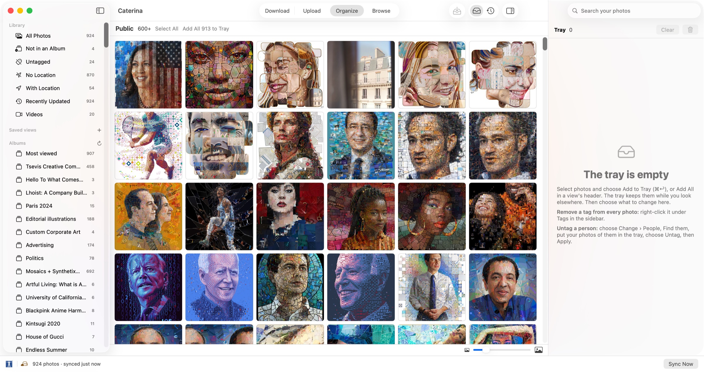
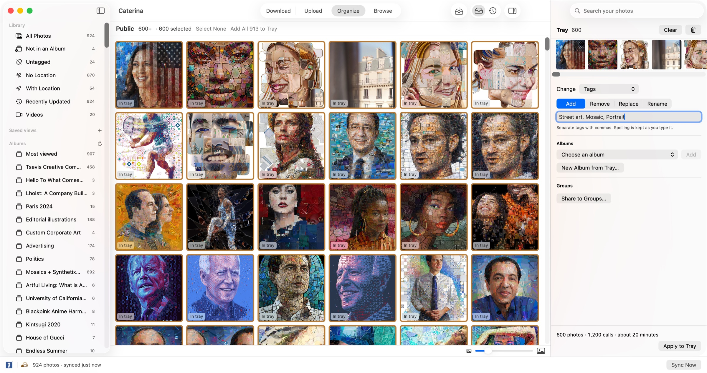
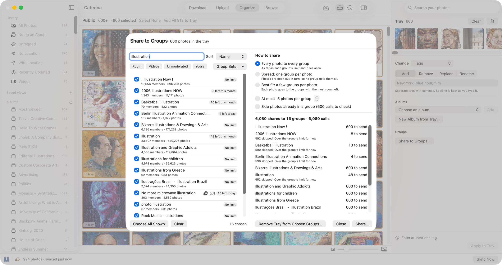
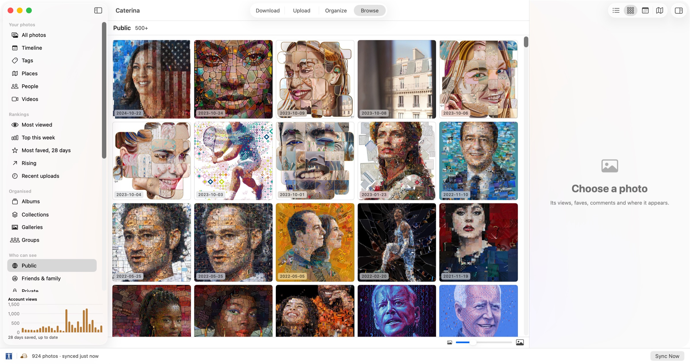
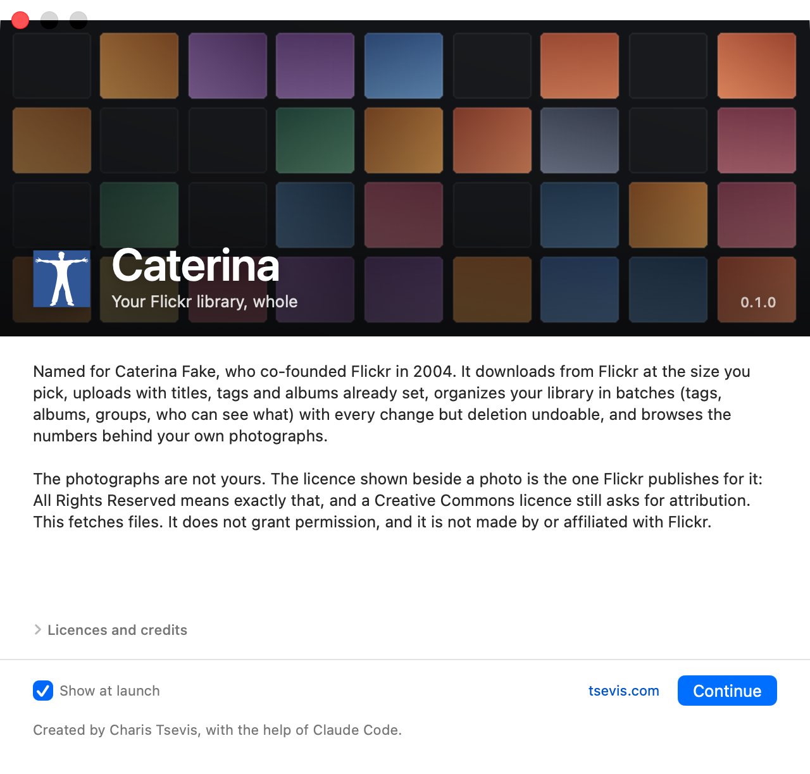
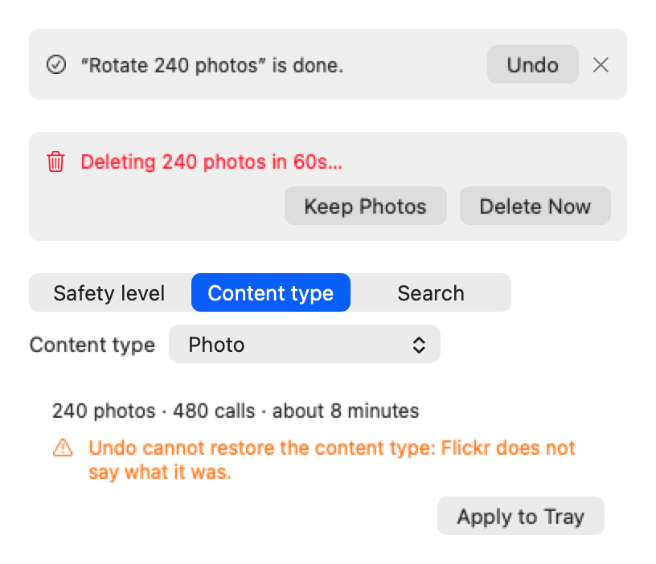

# Caterina

A native macOS app for your whole Flickr library — download, upload, organize
and browse — named for **Caterina Fake**, who co-founded Flickr in 2004.

It rebuilds Flickr's web Organizr as batch edits on your Mac: find photos in
smart views, gather them in a tray, see what an edit will cost in calls and
time before it runs, and **undo any change**. Deleting, which Flickr cannot
take back, waits a minute first.



**Status: built, notarised and in use by its author.** Everything below is
covered by more than 800 offline tests; Flickr writes are recorded so an
interrupted batch resumes and a finished one can be undone.

## Four tabs, one library

* **Download** — search Flickr, a photostream or a group's pool, and save what
  you select at the size you pick, with a `Credits.csv` beside it.
* **Upload** — drop files and folders; titles, captions and keywords in the
  files come along; presets, albums, and a queue that survives quitting.
* **Organize** — smart views (not in an album, untagged, no location, by
  audience, licence, month, tag, album), search as you type, and batch edits:
  titles and descriptions with patterns, tags (add, remove, replace, rename,
  or remove one everywhere), who can see and comment, safety and content
  type, licence, dates taken and posted, location on a map, rotation, people,
  albums, groups and galleries. Delete stands apart, behind its own question,
  a 60-second countdown and Flickr's own permission.
* **Browse** — rankings, a timeline, a map, albums, groups and every number
  Flickr keeps for a photo, with daily stats kept past Flickr's 28 days.



### Share to groups

Search your groups by any word of their names, filter by room left, videos,
moderation or the groups you run, save choices as group sets, and pick how to
share: every photo to every group, spread one group per photo, or best fit.
The preview reads each group's limit and says, per group, what will go and
why the rest will not; the report afterwards counts what was added, what waits
for a moderator and what each group refused.





<p align="center"></p>

## What you need before it works

Flickr gives every application its own API key. Getting one takes a minute and
costs nothing.

1. Create a key at <https://www.flickr.com/services/apps/create/>.
2. On the app's record at Flickr, set the **callback URL** to exactly:

   ```
   caterina://auth
   ```

   This is what lets sign-in hand the verifier straight back to the app instead
   of making you copy a nine-digit code out of a browser. The same value is
   registered in `App/Caterina/Info.plist` under `CFBundleURLTypes`.
3. Launch Caterina and paste the key and secret into the sheet it opens.

The key, the secret and the access token are kept in the macOS **Keychain**.
They are never written to a file, to `UserDefaults`, or into source.

Searching needs only the key. Signing in reads your own library with `read`
permission; the first change you make asks Flickr for `write`, and deleting
asks separately for `delete`.

## Building

```bash
make test     # offline, headless: no network, no windows
make app      # Release .app in .build/xcode
make run
make sign     # Developer ID, notarised, stapled DMG
```

`swift build` and `swift test` work without Xcode. `make app` needs
[XcodeGen](https://github.com/yonaskolb/XcodeGen) (`brew install xcodegen`).

Requires macOS 15 and Swift 6.

## How it is laid out

```
Sources/
  FlickrKit/            pure Swift — no SwiftUI, no AppKit, fully testable
  CaterinaLibrary/      the local copy of your library and the edit record (GRDB)
  CaterinaUI/           the SwiftUI layer, one folder per tab
App/                    a thin Xcode shell: Info.plist, entitlements, @main
Tests/                  800+ tests, none opening a window
```

`FlickrKit` links no UI framework, and `make lint` fails if one appears. That is
what lets every rule below be tested without a window on screen.

## The rules that are not obvious

Each of these was a defect in the reference application, and each has a test.

* **Selection and pagination belong to one source.** Four sources, four
  `SectionState` values, no global "current page". A load only ever writes back
  into the source it belongs to, and carries a generation so a superseded reply
  is dropped rather than drawn.
* **A new query starts at page 1.** A new term, a different user, a different
  group, a changed filter. Only Next/Previous and the per-page control preserve
  a position.
* **OAuth signing is RFC 5849, not form encoding.** Space is `%20`, never `+`;
  the unreserved set is exactly `A-Za-z0-9-._~`; parameters sort by their
  *encoded* key. A `+` where a `%20` belongs is answered with HTTP 401
  `oauth_problem=signature_invalid`, which looks like a credentials problem and
  is not one.
* **Sort is exclusive and offers only values Flickr accepts.** Flickr answers
  `stat=ok` for a sort value it does not recognise, so a wrong one is invisible
  in the reply. The tests assert on the outgoing query, never the response.
* **Filters are hidden where they do nothing.** `flickr.groups.pools.getPhotos`
  and `flickr.people.getPhotos` accept no licence, colour or sort parameter; the
  inspector says so rather than pretending.
* **Licence 0 is a selection, not "unset".** All Rights Reserved is a licence
  you can search for. Dropping it made that search return everything.
* **Size comes from the largest variant Flickr published.** Flickr never
  upscales, so a variant's existence is a lower bound. Asking whether a *small*
  variant exists classified every photo as small.
* **A group name must match exactly.** `flickr.groups.search` is fuzzy; taking
  its first result loaded unrelated groups.
* **A size fallback downgrades, never upgrades.** The size you pick is a
  ceiling. A photo with no file at that size is saved at the largest size below
  it — not at the Original, which on three hundred photos is gigabytes you did
  not ask for.
* **Downloads are atomic.** Bytes go to `<name>.part`, opened with `O_NOFOLLOW`
  so a planted symlink cannot redirect the write, and are renamed into place
  only once the transfer completes. Cancelling deletes the partial file and
  reports "Saved N of M", where N is the number of files actually on disk.
* **Flickr serves about 4000 results.** The reachable page count is clamped to
  that, with the reason shown, rather than letting you page into duplicates.

## Organize: batch edits with undo

Organize is Flickr's Organizr rebuilt: find photos in smart views, gather them
in a tray, see the calls and time an edit will take, run it, and undo it.
One wrong selection is never the end:

* **The edit that just finished offers Undo** in the tray and in Activity, and
  Edit › Undo on Flickr (⌥⌘Z) takes back the newest one after asking. Not ⌘Z:
  that stays with the text fields, where undoing a typo must not rewrite
  hundreds of photos.
* **Deleting waits 60 seconds.** Flickr has no trash, so nothing is sent until
  the countdown ends; Keep Photos takes it back, and quitting sends nothing.
* **What undo cannot fully restore always asks first**, whatever the count, and
  names it: Flickr does not report a photo's earlier safety level, content
  type or search visibility.
* **Back up first.** Download saves your originals; Your Flickr Data on
  flickr.com exports titles, tags and albums.

<p align="center"></p>

The rules that are not obvious:

* **Each photo is read from Flickr just before it is changed.** The local copy
  holds clean tags ("newyork") and can be behind; the change is laid over the
  photo as Flickr has it, so tag spellings survive and an edit made on
  flickr.com since the last sync is never silently written over.
* **A call whose reply can be lost is marked before it is sent.** Making an
  album and rotating are never sent twice; a batch interrupted there stops and
  says to look on flickr.com.
* **Every change except deleting can be undone**, including album edits and
  group sharing; undo is planned from what Flickr had just before.
* **Deleting is separate**: its own button, its own question naming the count,
  a countdown before anything is sent, and Flickr's own delete permission.

## What it writes, and what it keeps

* **A `Credits.csv` beside every download**, naming the photographer, the
  licence, a link to the terms, and the photo's page on Flickr. Creative Commons
  licences ask for attribution; a folder of JPEGs cannot give it.
* **Credentials in the Keychain**, as one item, marked *this device only* so
  they never ride an iCloud sync onto another Mac. Sign Out removes the token
  and keeps the API key.
* **A bounded thumbnail cache** in the app's container, and the folder you last
  downloaded into, as a security-scoped bookmark. Nothing else is stored, and
  nothing is sent anywhere but Flickr — there is no analytics, no telemetry and
  no crash reporting in this app.

## Known limitation: the sign-in callback

Sign-in returns through the custom URL scheme `caterina://auth`. macOS
has no ownership model for custom schemes — any app can register the same one,
and which app receives the redirect is not guaranteed. Two things limit what
that is worth to an attacker: the callback's request token is checked against
the one this window asked for, and the API key is yours rather than embedded in
the app, so an intercepted verifier cannot be exchanged without your secret. The
real fix is a Universal Link on a domain with an `apple-app-site-association`
file, which needs a domain; until then, this is the trade-off.

## Licence and credit

Photographs, titles and licence information come from the Flickr API and belong
to the photographers who made them. This is an independent application, not
affiliated with or endorsed by Flickr.

Created by Charis Tsevis, with the help of Claude Code.
